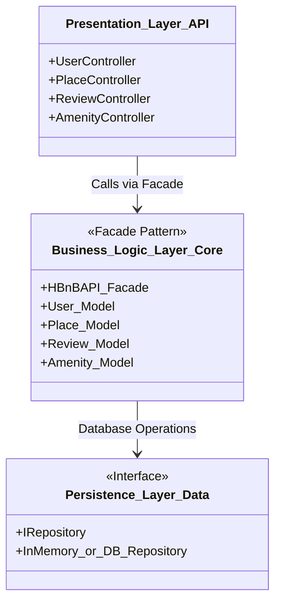
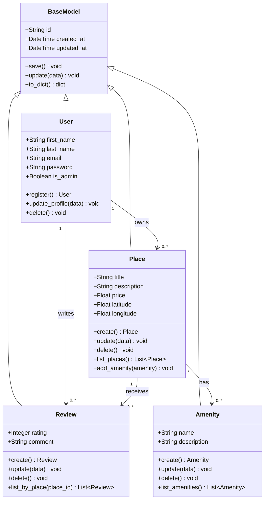
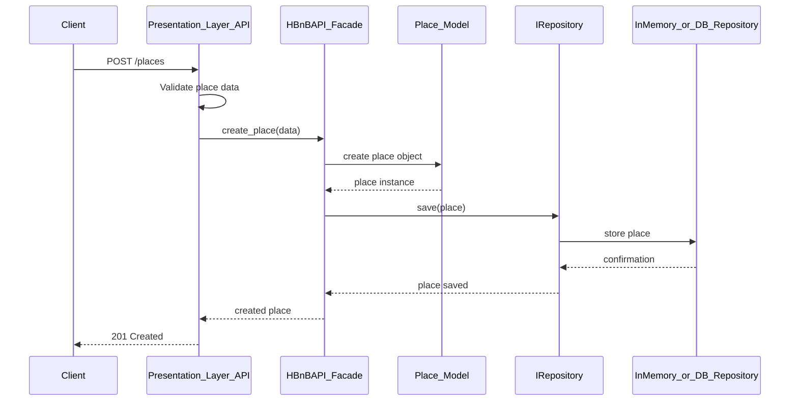
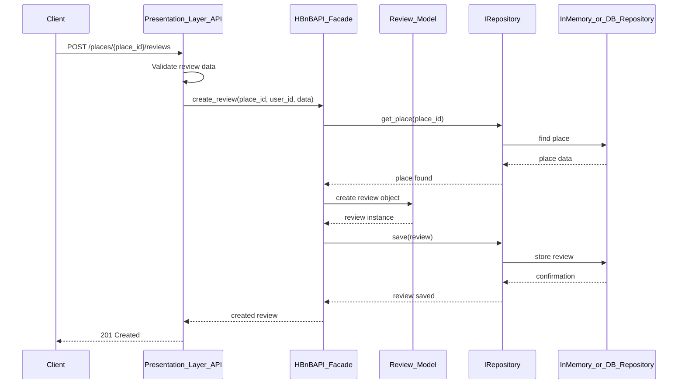
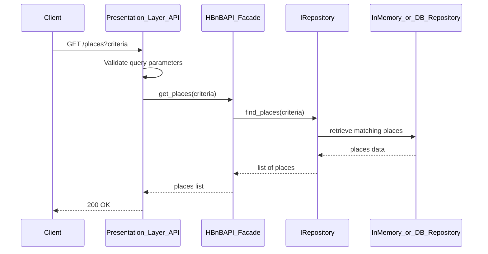

# HBnB Architecture Documentation

## Task 0: High-Level Package Diagram

The high-level package diagram illustrates the three-layer architecture of the HBnB application and the communication between these layers via the facade pattern.

---

## Task 1: Detailed Class Diagram — Business Logic Layer

This class diagram details the four core entities of the Business Logic layer —
`User`, `Place`, `Review`, and `Amenity` — including their attributes, methods, and
relationships. A shared `BaseModel` provides the common `id` (UUID4) and audit
timestamps (`created_at`, `updated_at`) required for every entity.

### Explanatory Notes — Class Diagram

- **BaseModel:** Abstract parent that guarantees each object has a unique `id`
  (UUID4) and the `created_at` / `updated_at` timestamps required for auditing. All
  entities inherit from it.
- **User:** Holds account data (`first_name`, `last_name`, `email`, `password`) and
  an `is_admin` flag to distinguish administrators from regular users. Can register,
  update its profile, and be deleted.
- **Place:** Represents a property listing with `title`, `description`, `price`,
  `latitude`, and `longitude`. Owned by one user and can hold many amenities.
- **Review:** A `rating` and `comment` written by a user about a place.
- **Amenity:** A feature (`name`, `description`) that can be linked to many places.

**Relationships:**

- **User → Place (1 to 0..\*):** An owner can own many places; each place belongs to
  exactly one owner.
- **User → Review (1 to 0..\*):** A user can write many reviews.
- **Place → Review (1 to 0..\*):** A place can receive many reviews; each review
  targets exactly one place.
- **Place ↔ Amenity (0..\* to 0..\*):** Many-to-many — a place can have many
  amenities, and an amenity can belong to many places.

## Task 2: Sequence Diagrams for API Calls

### 1. User Registration

### 2. Place Creation

This diagram shows how a new place is created. The request goes from the Presentation Layer to the Facade, then the place object is created and stored in the Persistence Layer.

### 3. Review Submission

This diagram shows the review submission process. The system checks that the place exists before creating and saving the review.

### 4. Fetching a List of Places

This diagram shows how the application fetches a list of places. The API receives the search criteria, the Facade processes the request, and the repository retrieves matching places.

## Explanatory Notes

These sequence diagrams describe the flow of four main API calls in the HBnB application: user registration, place creation, review submission, and fetching a list of places.

The Presentation Layer receives requests from the client and validates the input. The Business Logic Layer, represented by the HBnBAPI_Facade, processes the request and applies the application rules. The Persistence Layer, represented by IRepository and InMemory_or_DB_Repository, handles saving and retrieving data.

The Facade pattern helps separate the Presentation Layer from the Persistence Layer, making the application easier to organize, maintain, and extend.
