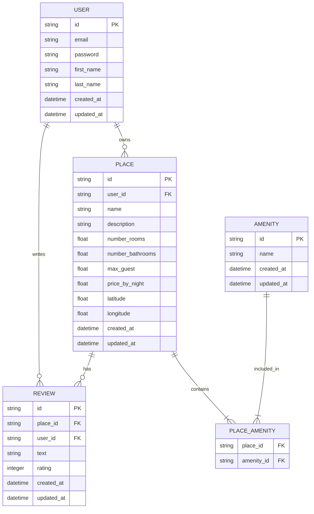

# HBnB - Database Entity-Relationship (ER) Diagram

Below is the Entity-Relationship diagram representing the database schema for the HBnB project, including `User`, `Place`, `Review`, `Amenity`, and the join table `Place_Amenity`.

